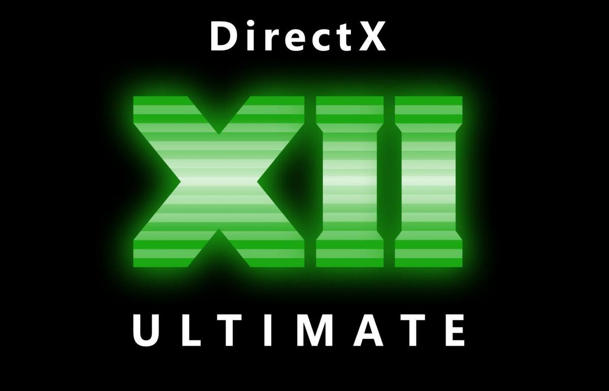

# graphics-developer-roadmap

This repository contains different resources which may be helpful during your journey of becoming a graphics developer. The list is supported by [@prographon](https://github.com/prographon) community. Our current plans include finding more high-quality books, tutorials and articles, creating a step-by-step guide (roadmap) for becoming a graphics engineer and sharing knowledge about new edge-breaking technologies in Computer Graphics.

## How to start learning

### Required preparations

The first thing to note is that to become graphic/rendering developer you must really know a lot. Almost all engines are written in C++, so you must certainly learn it first before diving into rendering. Knowledge of computer architecture is also highly recommended, specifically GPU architecture. C++/other languages resources are **not** present in this roadmap, as they are not explicitly related to graphics. You can either learn these topics first and then return to graphics, or try learning everything in parallel - the choice is up to you. Also, it is required to understand at least basics of linear algebra and trigonometry.

### Starting point

One of the easiest way to touch graphics programming without dealing with real graphic APIs is to write a software rasterizer/raytracer. [Ssloy's tutorials](https://github.com/ssloy/tinyrenderer/wiki) contain two very well written tutorials: [tinyraytracer](https://github.com/ssloy/tinyraytracer/wiki) and [tinyrenderer](https://github.com/ssloy/tinyrenderer/wiki/Lesson-0:-getting-started). You can go through them first and get a good insight on how raytracing and graphic API implementation works, without even touching a real GPU.

### Parallel computing

The best way to get insight of how GPU work is to try to adapt your code for parallel processing. If you followed the first step, at this point you have a nice looking path tracer / renderer, which now you can speed up by porting your rendering code to [OpenCL]() or [Cuda](https://docs.nvidia.com/cuda/cuda-c-programming-guide/index.html). These are the frameworks for general purpose GPU computing which are not yet graphic APIs, but introduce some new concepts with which you should become familiar. If you already tried to optimize your projects by utilizing multiple CPU cores, the process of porting should not be hard.

### OpenGL as first graphic API

 Now when you have a bit of understanding of how interact with GPU, you can finally dive into real graphic APIs. The opinions may vary, but the smoothest learning curve is achieved when you start from the simplest graphic APIs, such as OpenGL, and only after mastering it switching to more verbose, like DirectX 12 or Vulkan. Note that even with OpenGL you can write almost everything, including 2D renderer, first-person shooter game or general-purpose game engine. It is okay spending a year on a project which seemed simple at first glance, as long as it helps you to learn and give you a joy. For best start we suggest watching Cherno's [OpenGL series](https://www.youtube.com/watch?v=W3gAzLwfIP0&list=PLlrATfBNZ98foTJPJ_Ev03o2oq3-GGOS2&ab_channel=TheCherno) and going through [LearnOpenGL turorials](https://learnopengl.com/). Your main goal at this stage is to understand how GPU rendering works, implement classic algorithms like [shadow mapping](https://learnopengl.com/Advanced-Lighting/Shadows/Shadow-Mapping) and [deferred rendering](https://learnopengl.com/Advanced-Lighting/Deferred-Shading), and create your own [physically based renderer](https://academy.substance3d.com/courses/the-pbr-guide-part-1). We believe that these are the topics which any graphic engineer should understand to be ready for real job in rendering team.

### Vulkan/DirectX12

At this point you should be quite familiar with graphic API and can implement some basic algorithms in graphics. From here you can move forward to more advanced APIs, like Vulkan, DirectX12 or Metal, which are positioned as industry standard in most companies which focus on gamedev/CGI. It does not actually matter a lot which API from these three you choose, as they are all quite simular and it does not take much time to switch from one to another. In this guide we suggest to stick with Vulkan, because it is cross-platform, have lots of great tutorials and materials and introduce most of the graphic API concepts which you potentially may encounter while working with any other graphic API.
As you already have an OpenGL renderer, a good idea will be to port it to Vulkan API (or maybe support both APis). To begin with, we suggest to follow [Intel's Vulkan guide](https://software.intel.com/content/www/us/en/develop/articles/api-without-secrets-introduction-to-vulkan-preface.html), with assist of some additional resources, like [`Vulkan Engine Guide`](https://vkguide.dev/) and [`Writing an efficient Vulkan renderer` by Zeux](https://zeux.io/2020/02/27/writing-an-efficient-vulkan-renderer/). During development you will definitely encounter some problems which may seem hard to deal with, such as barrier placement, descriptor allocation, render pass manegement. As they are quite common, people have already come up with some good solid solutions, like [render-graph based rendering](https://themaister.net/blog/2017/08/) and [hybrid rendering](https://media.contentapi.ea.com/content/dam/ea/seed/presentations/wihlidal-halcyonarchitecture-notes.pdf). 
So, all in all, the main goal for your at this stage is to create a high-performance, low overhead rendering framework with convinient to use interface. It will be both a good pet project for your graphics developer resume and an excellent sandbox with lots of opportunities for further experimentations.

## Graphic API

### OpenGL

- [Learn OpenGL](https://learnopengl.com/) - modern (3.3+) OpenGL tutorial (phong lighting, shadow mapping, mesh loading, deferred rendering, PBR + IBL lighting) 
- [OpenGL step by step](http://ogldev.atspace.co.uk/) - modern (3.3+) OpenGL tutorial (phong lighting, shadow mapping, mesh loading, deferred rendering, skeletal animation)
- [OpenGL tutorial](http://www.opengl-tutorial.org/) - modern (3.3+) OpenGL tutorial (phong lighting, shadow mapping, text rendering, mesh loading)
- [OpenGL by The Cherno](https://www.youtube.com/watch?v=W3gAzLwfIP0&list=PLlrATfBNZ98foTJPJ_Ev03o2oq3-GGOS2&ab_channel=TheCherno) - step by step OpenGL course for beginners (basic 2D rendering, texturing, batching)

### Vulkan

- [Vulkan 1.2 API Specifications](https://www.khronos.org/registry/vulkan/specs/1.2-extensions/html/index.html) - Official Vulkan specification by Khronos Group
- [Vulkan Tutorial](https://vulkan-tutorial.com/) - Vulkan tutorial teaching basics of the API (initializing context, drawing triangle, texturing, mesh loading)
- [API without Secrets: Introduction to Vulkan](https://software.intel.com/content/www/us/en/develop/articles/api-without-secrets-introduction-to-vulkan-preface.html) - in depth tutorial about Vulkan API (initializing context, swapchain, drawing triangle, descriptor sets) 
- [Vulkan Guide](https://github.com/KhronosGroup/Vulkan-Guide) - Vulkan guide by Khronos Group (graphic pipeline, layers, memory allocations, synchronization)
- [niagara: Building a Vulkan renderer from scratch](https://www.youtube.com/playlist?list=PL0JVLUVCkk-l7CWCn3-cdftR0oajugYvd) - In-depth lessons series about how to use few modern Vulkan rendering techniques, such as GPU culling & scene submission, cone culling, automatic occlusion culling, task/mesh shading, and others
- [Tips and Tricks: Vulkan Dos and Don’ts](https://developer.nvidia.com/blog/vulkan-dos-donts/) - Nvidia's tips for designing high performance Vulkan applications
- [Vulkanised](https://www.youtube.com/watch?v=1rDCNknSb2s&list=PLYO7XTAX41FPMg41svrVJA9stwcYCvdW0) - Open webinars about Vulkan best practices and pitfalls by Khronos Group
- [Writing an efficient Vulkan renderer](https://zeux.io/2020/02/27/writing-an-efficient-vulkan-renderer/) - Chapter about Vulkan renderer from GPU Zen 2 book in a form of the blogpost
- [Vulkan Engine Guide](https://vkguide.dev/) - Vulkan game engine guide focuses around dynamic rendering. This tutorial use extra libraries like Vk Bootstrap and VMA to simplify boilerplate Vulkan code and memory allocation.
- [Vulkan Game Engine by Brendan Galea](https://www.youtube.com/playlist?list=PL8327DO66nu9qYVKLDmdLW_84-yE4auCR) - Useful step by step tutorial on writing a game engine with a detailed illustrated description of how Vulkan works (not finished yet). 
- [Yet another blog explaining Vulkan synchronization](https://themaister.net/blog/2019/08/14/yet-another-blog-explaining-vulkan-synchronization/) - guide to Vulkan synchronization (barriers, semaphores, fences and etc.). Referenced by official Khronos blog.
- [Render graphs and Vulkan - a deep dive](https://themaister.net/blog/2017/08/) - series of articles about implementation of render-graph based rendering in Vulkan

### DirectX 12

- [Learning DirectX 12](https://www.3dgep.com/learning-directx-12-1/) - in depth tutorial about DirectX 12 API (graphic pipeline, command queues, descriptor sets, texturing)
- [Official DirectX 12 Graphics samples by Microsoft](https://github.com/microsoft/DirectX-Graphics-Samples)
- [Official DirectX documentation](https://docs.microsoft.com/en-us/windows/win32/directx)
- [Official DXIL documentation](https://github.com/microsoft/DirectXShaderCompiler/blob/master/docs/DXIL.rst)
- [DirectX supplementary specs (GitHub)](https://microsoft.github.io/DirectX-Specs/)
- [DirectX 3D Series](https://wiki.planetchili.net/index.php/Hardware_3D_Series_(C%2B%2B_DirectX_Graphics))
- [Braynzar soft DirectX 12 tutorials](https://www.braynzarsoft.net/viewtutorial/q16390-04-directx-12-braynzar-soft-tutorials)

### WebGPU

- [Explainer and FAQ](https://gpuweb.github.io/gpuweb/explainer/) - why proposed
- [WebGPU Shading Language](https://www.w3.org/TR/WGSL/) - working draft
- [webgpu.h](https://github.com/webgpu-native/webgpu-headers/blob/main/webgpu.h) - header as a platform-agnostic HAL between implementations
- [dawn](https://dawn.googlesource.com/dawn) - C++ implementation from Google
- [wgpu](https://github.com/gfx-rs/wgpu) - Rust implementation from Mozilla

## Software Rasterization
- [demo.design 3D programming FAQ](https://www.enlight.ru/faq3d/content.htm)
- [Fast affine texture mapping](http://ftp.lanet.lv/ftp/mirror/x2ftp/msdos/programming/theory/fatmap.txt)
- [Ultimate /|\ ATARI 4nd d3m0 coding page !!!](https://mikro.naprvyraz.sk/docs/index.htm)
- [Poor man's bilinear](https://www.hugi.scene.org/online/coding/hugi%2020%20-%20cobil.htm)
- [Coding 3D Engines by Luki](http://www.luki.webzdarma.cz/luki_engine_en.htm)
- [256-Color VGA Programming in C](http://www.brackeen.com/vga/index.html)
- [PlayStation Ordering Table Tutorial](https://psx.arthus.net/sdk/Psy-Q/DOCS/TECHNOTE/ordtbl.pdf)
- [The Coverage Buffer (C-Buffer)](https://www.flipcode.com/archives/The_Coverage_Buffer_C-Buffer.shtml)

## Books
- [Realtime Rendering](https://www.amazon.com/Real-Time-Rendering-Fourth-Tomas-Akenine-M%C3%B6ller/dp/1138627003) (graphics hardware, shading & lighting algorithms, ray tracing)
- [Physically Based Rendering: From Theory To Implementation](http://www.pbr-book.org/) (PBR, photorealistic rendering, sampling methods)
- [Substance PBR Guide](https://academy.substance3d.com/courses/the-pbr-guide-part-1)
- [Advanced Global Illumination](https://www.amazon.com/Advanced-Global-Illumination-Philip-Dutre/dp/1568813074) (global illumination algorithms, light transport theory, radiosity)
- [GPU Gems](https://developer.nvidia.com/gpugems/gpugems/contributors) (collections of different 3D graphics algorithms)
- [Ray Tracing in One Weekend Book Series](https://github.com/RayTracing/raytracing.github.io) (software ray tracing, BVH)
- [Collection of PDF books about graphics and programming](https://drive.google.com/drive/folders/1D-M15SvPxF1JqmzRt1UenQ1x6Zp_Ebb9?usp=sharing)
- [GPU Pro](https://www.amazon.com/GPU-Pro-Advanced-Rendering-Techniques/dp/1568814720) (like GPU Gems, but it's closer to state-of-art)
- [Mathematics for 3D Game Programming and Computer Graphics](https://www.amazon.co.uk/Mathematics-Game-Programming-Computer-Graphics/dp/1435458869/ref=sr_1_1?keywords=mathematics+for+3d+game+programming+and+computer+graphics&qid=1680135551&sprefix=mathematics+for+3d+game+progra%2Caps%2C75&sr=8-1) (very useful book, covers almost everything needed for a start, pretty much a classic book)

## Graphics Labs Publications
- [EPFL Realistic Graphics Lab](http://rgl.epfl.ch/publications)
- [KIT Computer Graphics Group](https://cg.ivd.kit.edu/english/publikationen.php)
- [Utah Graphics Lab](https://graphics.cs.utah.edu/research/publications)
- [Cornell University](https://www.graphics.cornell.edu/resources/publications)
- [NVIDIA](https://research.nvidia.com/publications)
- [AMD](https://gpuopen.com/learn/publications)
- [Valve](https://www.valvesoftware.com/en/publications)
- [Unity](https://unity.com/publications)

## Articles
- [Common Interview Questions for a Graphics Programmer](https://erkaman.github.io/posts/junior_graphics_programmer_interview.html) - checklist for a Junior Graphics Programmer
- [Basic Theory of Physically-Based Rendering by Marmoset](https://marmoset.co/posts/basic-theory-of-physically-based-rendering/)
- [Physically Based Rendering in Filament](https://google.github.io/filament/Filament.html) - equations and theory behind the material and lighting models used in Filament.

## Tutorials
- [Ssloy's tutorials](https://github.com/ssloy/tinyrenderer/wiki) - tinyrenderer (software rasterizer), tinyraytacer (software ray-tracer)
- [Common techniques to improve shadow maps](https://docs.microsoft.com/en-us/windows/win32/dxtecharts/common-techniques-to-improve-shadow-depth-maps) - antialiasing algorithm for shadows, cascaded shadow maps, solutions to common problems (with DirectX 11 code snippets)
- [AMD RDNA2 Perfomance Guide](https://gpuopen.com/performance/)

## Courses
- [Advances in Real-Time Rendering in 3D Graphics and Games](http://advances.realtimerendering.com/)
- [GDC Vault](https://www.gdcvault.com/)
- [Interactive 3D Graphics (Eric Haines)](https://www.udacity.com/course/interactive-3d-graphics--cs291)

## Video courses
- [TU Wien Ray tracing course](https://www.youtube.com/playlist?list=PLujxSBD-JXgnGmsn7gEyN28P1DnRZG7qi) - A course on photorealistic rendering, ray tracing and global illumination at the TU Wien
- [Cem Yuksel Intro to Graphics](https://www.youtube.com/playlist?list=PLplnkTzzqsZTfYh4UbhLGpI5kGd5oW_Hh) - A course explaining mostly theoretical part of computer graphics, global illumination and simulation
- [Cem Yuksel Interactive Graphics](https://www.youtube.com/playlist?list=PLplnkTzzqsZS3R5DjmCQsqupu43oS9CFN) - A course mostly for practical real-time renderer implementation

## Digests
- [Two Minute Papers](https://www.youtube.com/channel/UCbfYPyITQ-7l4upoX8nvctg) - summaries of modern articles on computer graphics
- [Graphics Programming weekly](https://www.jendrikillner.com/tags/weekly/) - weekly newsletter with CG materials

## Blogs
- [Self Shadow](https://blog.selfshadow.com/) - Stephen Hill, principal rendering engineer, Lucasfilm Advanced Development Group
- [Wicked Engine Net](https://wickedengine.net/) - blog about computer graphics and game engine dev by graphics programmer at Sony
- [Ray Tracey's blog](http://raytracey.blogspot.com/) - Sam Lapere, scientific visualization devtech at Nvidia
- [Eric Heitz](https://eheitzresearch.wordpress.com/research/) - research scientist at Unity Technologies
- [Wenzel Jakob](http://rgl.epfl.ch/people/wjakob) - assistant professor leading the Realistic Graphics Lab at EPFL's School of Computer and Communication Sciences
- [Real-time rendering resources](https://www.realtimerendering.com/) - resources page for the book Real-Time Rendering and a lot of useful links
- [Alian Galvan](https://alain.xyz/blog) - graphics programmer at Marmoset about engine development, samples with different graphics API
- [Game Development by Sean](https://seanmiddleditch.com/) - game and engine development, common techniques
- [CODE517E](https://c0de517e.blogspot.com/) - blog about graphics by graphics programmer at Altera
- [Aras P](https://aras-p.info/blog/) - lead graphics programmer at Unity, contains many tricks and techniques
- [Arseny Kapoulkine](https://zeux.io/) - technical fellow at Roblox, Vulkan-related and mobile stuff
- [Adrian Courreges](http://www.adriancourreges.com/blog/) - collection of frame analysis during current decade of different games
- [Matt Pettineo](https://therealmjp.github.io/posts/) - lead graphics/engine programmer at Ready At Dawn Studios, articles about Spherical Gaussians and GPU Barriers
- [Emilio Lopez](http://www.elopezr.com/) - Senior Graphics Engineer at Playground Games. Previously making LEGO at Traveller's Tales.
- [Simon Coenen](https://simoncoenen.com/blog) - Platform Engineer at Studio Gobo, Brighton.
- [Inigo Quilez](https://iquilezles.org/articles/) - articles about sdf, raymarching etc.
- [Jasper St. Pierre](https://blog.mecheye.net/) - Creator of [noclip.website](https://noclip.website/) and [YouTube channel](https://www.youtube.com/user/DaysAreRare). Staff Graphics Engineer at Cryptic Studios.
- [Maister's Graphics Adventures](https://themaister.net/blog/) - low level graphics programming from author of [Granite](https://github.com/Themaister/Granite)
- [A trip through the Graphics Pipeline 2011](https://fgiesen.wordpress.com/2011/07/09/a-trip-through-the-graphics-pipeline-2011-index/) - Old but still up-to-date articles on GPU and driver internals.
- [Krzysztof Narkowicz](https://knarkowicz.wordpress.com/) - Technical director of graphics at Epic Games.

## Useful sites
- [Shader Playground](http://shader-playground.timjones.io/) - powerful online shader compiler
- [Shadertoy](https://www.shadertoy.com/) - shader showcase sandbox
- [GPU info](https://gpuinfo.org/) - open database of Vulkan, GL and GLES devices, their capabilities and supported extensions
- [HexEd](https://hexed.it/) - browser-based hex editor

## Tools
- [RenderDoc](https://renderdoc.org/) - very powerful Vulkan, DirectX and OpenGL debugger with support of in-engine integration
- [AMD CodeXL](https://github.com/GPUOpen-Archive/CodeXL) - CPU/GPU debugger and profiler
- [AMD Compressonator](https://gpuopen.com/compressonator/) - tool for texture compression
- [AMD GPU Profiler](https://gpuopen.com/rgp/)
- [AMD Memory Visualizer](https://gpuopen.com/rmv/)
- [AMD Developer Panel](https://gpuopen.com/rdp/)
- [AMD GPU Analyzer](https://gpuopen.com/rga/) - offline compiling tool and ISA inspector
- [NVidia NSight](https://developer.nvidia.com/nsight-graphics) - powerful profiling tool, support of ray-tracing debugging
- [Intel GPA](https://software.intel.com/content/www/us/en/develop/tools/graphics-performance-analyzers.html)
- [Apple Metal debugger](https://developer.apple.com/documentation/metal/basic_tasks_and_concepts/viewing_your_gpu_workload_with_the_metal_debugger) - powerful macOS and iOS graphics debugger, profiler with shader debugging
- [ShaderED](https://shadered.org/) - shader IDE with lots of debugging utilities
- [Microsoft PIX](https://devblogs.microsoft.com/pix/introduction/) - powerful Windows and XBOX debugger and profiler
- [PowerVR SDK Tools](https://www.imaginationtech.com/developers/powervr-sdk-tools/) - collection of tools for graphics programming
- [Naga](https://github.com/gfx-rs/naga) - convert from one shader format into another
